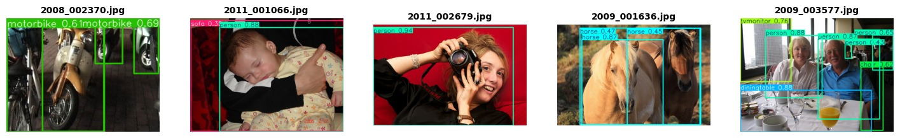

# Deep Learning Object Detection Benchmark: YOLO-V5 VS Faster R-CNN on Pascal VOC 2012
##  Objective

This project implements and compares **Faster R-CNN (two-stage detector)** and **YOLOv5 (single-stage detector)** on the **Pascal VOC 2012 dataset**.

The goal is to analyze the trade-off between:

*  Detection Accuracy (mAP)
*  Inference Speed (FPS)
*  Bounding Box Quality


---


## Benchmark goal

Compare the two detector families on the same dataset (VOC2012):
- **YOLOv5 (one-stage)**: optimized for speed/real-time detection.
- **Faster R-CNN (two-stage)**: typically higher-quality detections, often slower inference.

---


## Models Compared

### 1) YOLOv5 (One-stage Detector)
- Predicts bounding boxes + class probabilities in a single forward pass
- Typically:
  - Very fast inference
  - Strong baseline for real-time detection

### 2) Faster R-CNN (Two-stage Detector)
- Stage 1: Region Proposal Network (RPN)
- Stage 2: Classifies/refines proposals
- Typically:
  - Strong accuracy
  - Heavier compute and slower inference than YOLO-style models

----

## Requirements

```bash
python>=3.7
torch>=1.9.0
torchvision>=0.10.0
yolov5
opencv-python
matplotlib
seaborn
scikit-learn
pillow
tqdm
pandas
numpy
```
---
## Dataset

**Pascal VOC 2012** (20 object classes).  
This project was run on **Kaggle Notebooks**, so the dataset is expected to be attached to the Kaggle notebook session via **“Add data”**.

Typical Kaggle input location pattern:
- `/kaggle/input/<dataset-name>/...`


---

## How to reproduce on Kaggle

### 1) Create a Kaggle Notebook
- Enable **GPU** (recommended).

### 2) Add dataset
- Add a Pascal VOC 2012 dataset through the Kaggle sidebar (“Add data”).
- Confirm the path by listing:
```bash
!ls /kaggle/input
```

### 3) Run YOLOv5 pipeline (from the repo notebook)
Open and run:
- `YOLO V5/yolov5-execution.ipynb`

What it produces (as committed here):
- `YOLO V5/yolo_results_csv.csv`
- Plot images under `YOLO V5/yolo_results_plots/`

### 4) Run Faster R-CNN pipeline (from the repo notebook)
Open and run:
- `faster_rcnn_execution.ipynb`

What it produces (as committed here):
- CSV files under `rcnn_results_csv/`
- Plot images under `rcnn_results_plots/`

---

##   Preparation

### Pascal VOC 2012

* 20 object classes (person, car, bicycle, etc.)
* Dataset split:

  * **Train:** 70%
  * **Validation:** 20%
  * **Test:** 10%

### Annotation Formats

* **Faster R-CNN:** Pascal VOC XML
* **YOLOv5:** YOLO TXT format

---

##  Models Implemented

### 🔹 Faster R-CNN (Two-Stage)

* Backbone: ResNet50 + FPN
* Stage 1: Region Proposal Network (RPN)
* Stage 2: Classification + Bounding Box Regression

### 🔹 YOLOv5 (Single-Stage)

* Real-time object detector
* Direct prediction of:

  * Bounding boxes
  * Class probabilities
  * Confidence scores

---

##  Training Pipeline

### Faster R-CNN

* Optimizer: SGD
* Loss components:

  * Classification loss
  * Bounding box regression loss
* Epochs: 10
* Output:

  * Model weights (`faster_rcnn_voc2012.pt`)
  * CSV metrics
  * Detection visualizations

### YOLOv5

* Pretrained weights: `yolov5s.pt`
* Epochs: ~100
* Automatic logging of:

  * Loss curves
  * mAP metrics
  * Validation performance

---


## Faster R-CNN Pipeline

The Faster R-CNN workflow is provided primarily via:

- `faster_rcnn_execution.ipynb`

### Typical Kaggle Setup
In the notebook, you generally need:
- PyTorch + torchvision (already available in many Kaggle GPU images)
- Common packages: `numpy`, `pandas`, `matplotlib`, `opencv-python`

## YOLOv5 Pipeline


### Environment Setup (Kaggle)
```bash
!python -V
!nvidia-smi
```

If you are using the official YOLOv5 repo approach:
```bash
!git clone https://github.com/ultralytics/yolov5
%cd yolov5
!pip install -r requirements.txt
```

### Data Preparation (VOC → YOLO format)
YOLO expects:
- images in `images/train`, `images/val`
- labels in YOLO txt format in `labels/train`, `labels/val`
- a dataset YAML file like `voc.yaml`

You need a conversion step if your dataset is in VOC XML format.

**Checklist:**
- [ ] Confirm image paths
- [ ] Convert VOC XML annotations → YOLO txt labels
- [ ] Create `voc.yaml` with:
  - `train: ...`
  - `val: ...`
  - `nc: 20`
  - `names: [ ...VOC class names... ]`

### Training
Example (adjust model size + epochs based on runtime budget):
```bash
!python train.py --img 640 --batch 16 --epochs 50 --data voc.yaml --weights yolov5s.pt
```

### Inference
```bash
!python detect.py --weights runs/train/exp/weights/best.pt --img 640 --source <path-to-test-images>
```

### Evaluation
YOLOv5 provides evaluation metrics (including mAP) via validation:
```bash
!python val.py --weights runs/train/exp/weights/best.pt --data voc.yaml --img 640
```

---

### Training
The training loop typically includes:
- dataset loader (VOC)
- model initialization 
- optimizer + scheduler
- epoch loop
- checkpoint saving

**Recommended to log:**
- training loss breakdown (RPN objectness, bbox regression, classifier loss, etc.)
- evaluation metric(s) each epoch (mAP if implemented)
- wall-clock time per epoch

### Inference
Inference typically:
- loads model weights/checkpoint
- runs prediction on validation/test images
- applies confidence thresholding
- optionally applies NMS (usually handled internally)
- renders predicted boxes on images

### Evaluation
For Faster R-CNN evaluation on VOC, you may implement:
- VOC mAP calculation (VOC07 11-point or VOC2010+ style)
- or COCO-style mAP if you convert annotations to COCO

Your repo indicates you save:
- CSV metrics → `rcnn_results_csv/`
- plots → `rcnn_results_plots/`

---


### Notebooks (main execution)
- **YOLOv5 notebook:** `YOLO V5/yolov5-execution.ipynb`
- **Faster R-CNN notebook:** `faster_rcnn_execution.ipynb`

### Outputs already committed (results)
#### YOLOv5 outputs
- Results CSV: `YOLO V5/yolo_results_csv.csv`
- Plots: `YOLO V5/yolo_results_plots/`
  - `YOLO V5/yolo_results_plots/detection_results.png`
  - `YOLO V5/yolo_results_plots/training_metrics_curves.png`
  - `YOLO V5/yolo_results_plots/training_metrics_curves_2.png`

#### Faster R-CNN outputs
- CSVs: `rcnn_results_csv/`
  - `rcnn_results_csv/faster_rcnn_results.csv`
  - `rcnn_results_csv/faster_rcnn_training_metrics.csv`
  - `rcnn_results_csv/faster_rcnn_inference_speed.csv`
  - `rcnn_results_csv/faster_rcnn_detections.csv`
  - `rcnn_results_csv/faster_rcnn_class_distribution.csv`
- Plots: `rcnn_results_plots/`
  - `rcnn_results_plots/training_loss.png`
  - `rcnn_results_plots/training_metrics_curves.png`
  - `rcnn_results_plots/class_distribution.png`
  - `rcnn_results_plots/confidence_distribution.png`
  - `rcnn_results_plots/sample_detections.png`
  - `rcnn_results_plots/test_set_predictions.png`

---

##  Performance Evaluation Metrics

### 1. Mean Average Precision (mAP)

* mAP@0.5 (VOC standard)
* mAP@0.5:0.95 (COCO-style)

### 2. Inference Speed

* Time per image
* Frames Per Second (FPS)

### 3. Detection Quality

* False positives / negatives
* Bounding box precision
* Confidence scores

---

## Results (where to look)

### YOLOv5
- Numeric summary: `YOLO V5/yolo_results_csv.csv`
- Training curves + detection visualization:
  - `YOLO V5/yolo_results_plots/training_metrics_curves.png`
  - `YOLO V5/yolo_results_plots/training_metrics_curves_2.png`
  - `YOLO V5/yolo_results_plots/detection_results.png`

### Faster R-CNN
- Final metrics summary: `rcnn_results_csv/faster_rcnn_results.csv`
- Training metrics tracking: `rcnn_results_csv/faster_rcnn_training_metrics.csv`
- Inference speed logging: `rcnn_results_csv/faster_rcnn_inference_speed.csv`
- Detection-level outputs: `rcnn_results_csv/faster_rcnn_detections.csv`
- Visualizations:
  - `rcnn_results_plots/training_loss.png`
  - `rcnn_results_plots/training_metrics_curves.png`
  - `rcnn_results_plots/class_distribution.png`
  - `rcnn_results_plots/confidence_distribution.png`
  - `rcnn_results_plots/sample_detections.png`
  - `rcnn_results_plots/test_set_predictions.png`

---

## Notes on fair comparison

To ensure YOLOv5 vs Faster R-CNN comparison is meaningful:
- Keep consistent dataset split (train/val/test) and class mapping (VOC 20 classes).
- Use clearly stated evaluation criteria (e.g., IoU threshold(s), confidence thresholds).
- Report timing with warm-up (first inference often slower).
- Mention the Kaggle GPU type used if available (affects speed).

---


##   Analysis

### 🔹 Faster R-CNN Performance

####  Training Loss Curve


* Smooth convergence from **0.39 → 0.15**
* Stable learning without overfitting

---

#### 📊 mAP Scores

* **mAP@0.5:** `0.6569`
* **mAP@0.5:0.95:** `0.6569`

---

####  Class Distribution of Detections


* Strong bias toward **person class (1512 detections)**
* Lower detection counts for rare classes (train, aeroplane)

---

####  Confidence Score Analysis


* Mean confidence: **0.885**
* Most predictions fall in **0.9–1.0 range**
* Indicates high model certainty

---

### 🔹 Sample Predictions (Faster R-CNN)


* Accurate localization in most cases
* Handles multiple objects well
* Some overlapping detections in dense scenes

### 🔹 Sample Predictions (YOLO V5)



---

### 🔹 Test Set Predictions (Faster R-CNN)


### 🔹 Test Set Predictions (YOLO V5)


* Strong performance in:

  * Multi-object scenes
  * Occlusion handling
* Minor false positives in crowded areas

---

##  YOLOv5 Results

###  Training Loss

* Smooth decreasing trend
* Faster convergence than Faster R-CNN

---

###  mAP Performance

* **mAP@0.5:** ~0.73
* **mAP@0.5:0.95:** ~0.60

---

###  Key Observations

* Faster inference (real-time capable)
* Slightly lower localization precision vs Faster R-CNN
* Better scalability for deployment

---

##  Final Comparison

| Metric               | Faster R-CNN    | YOLOv5   |
| -------------------- | --------------- | -------- |
| mAP@0.5              | 0.6569          | ~0.73    |
| mAP@0.5:0.95         | 0.6569          | ~0.60    |
| Inference Speed      | Slow            | Fast     |
| Localization         | High Precision  | Moderate |
| Real-time Capability | No              | Yes    |

---

##  Key Insights

* **Faster R-CNN**

  * Better for **accuracy-focused tasks**
  * Strong bounding box precision
  * Suitable for research & analysis

* **YOLOv5**

  * Best for **real-time applications**
  * Faster and lightweight
  * Slight trade-off in precision


---

##  Conclusion

This project demonstrates the **accuracy vs speed trade-off** in object detection:

* Use **Faster R-CNN** when precision is critical
* Use **YOLOv5** when speed is essential

---

## Future Improvements

- [ ] Implement Faster-RCNN model
- [ ] Add quantization for mobile deployment
- [ ] Include confidence threshold analysis
- [ ] Add inference time comparison
- [ ] Implement model ensemble
- [ ] Add data augmentation experiments


## References

- [YoloV5 GitHub](https://github.com/ultralytics/yolov5)
- [Faster-RCNN Paper](https://arxiv.org/abs/1506.01497)
- [PyTorch Documentation](https://pytorch.org/docs/)

## Citations
- Pascal VOC: http://host.robots.ox.ac.uk/pascal/VOC/
- YOLOv5 (Ultralytics): https://github.com/ultralytics/yolov5
- Torchvision detection models (Faster R-CNN): https://pytorch.org/vision/stable/models.html


##  Author

Gubba Sai Ananya
